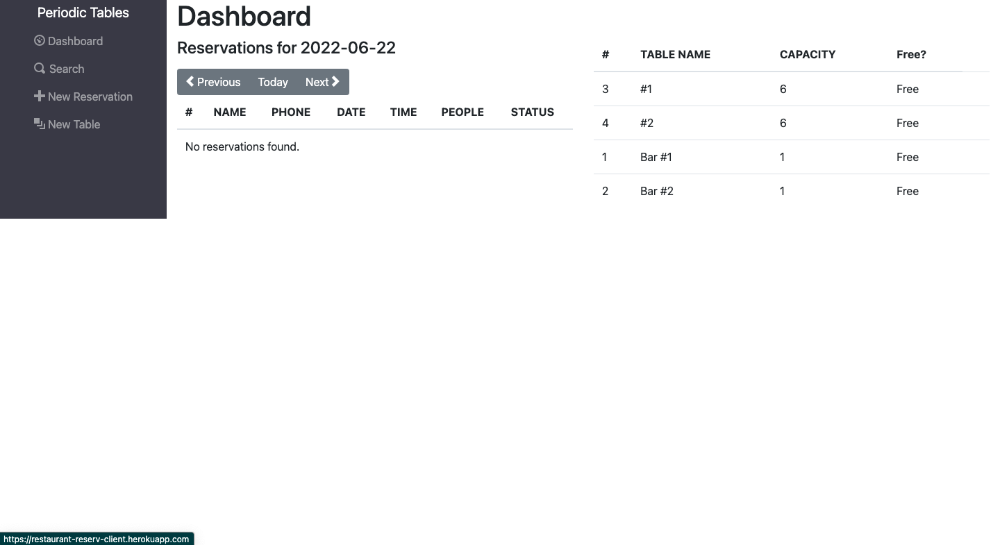
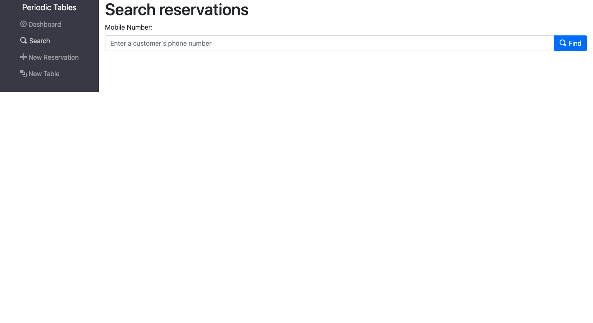
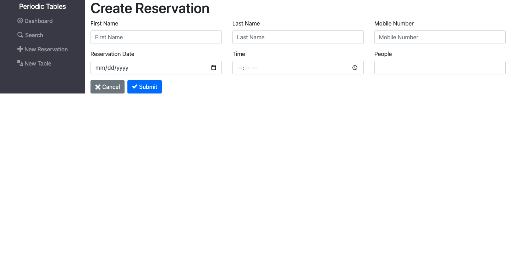
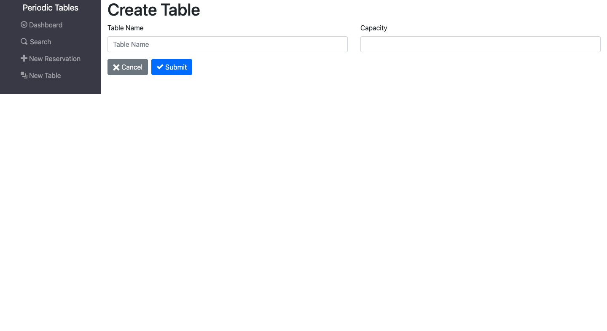

# Restaurant Reservation Application

Restaurant Reservation Application is a full-stack reservation app for fine dining restaurants. The software is used only by restaurant personnel when a customer calls to request a reservation.

## Links

- [Live Demo](https://restaurant-reserv-client.herokuapp.com)

- [Server](https://restaurant-reserv-server.herokuapp.com)

## Screenshots

### Home Page:

### Search:

Allows user to search for a reservation by phone number (partial or complete) so that one can quickly access a customer's reservation.

### New Reservation:

Allows user to to create a new reservation when a customer calls so that one knows how many customers will arrive at the restaurant on a given day.

### New Table:

Allows user to create a new table in addition to existing tables.

## Technology

### Built with:

- React, including useState and useEffect

  - Created with [create-react-app](https://github.com/facebook/create-react-app)

- Node, Express, and PostgreSQL API

### API Interface:

- Built to interface with Restaurant Reservation Client: [restaurant-reservation-server](https://restaurant-reserv-server.herokuapp.com)
